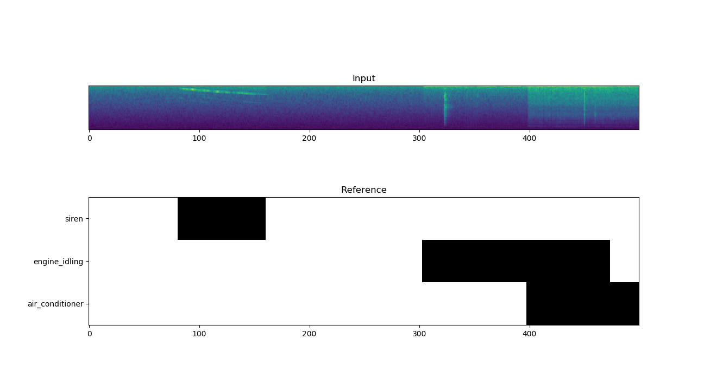
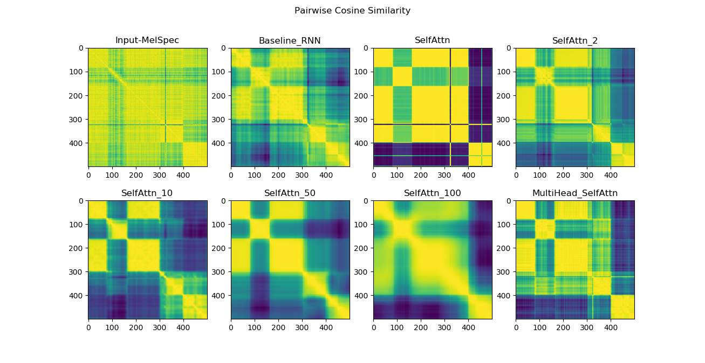
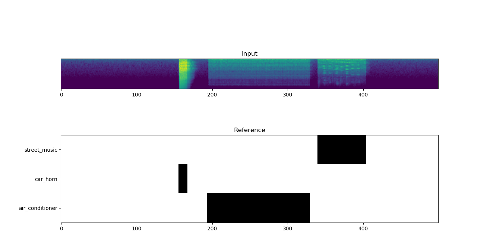
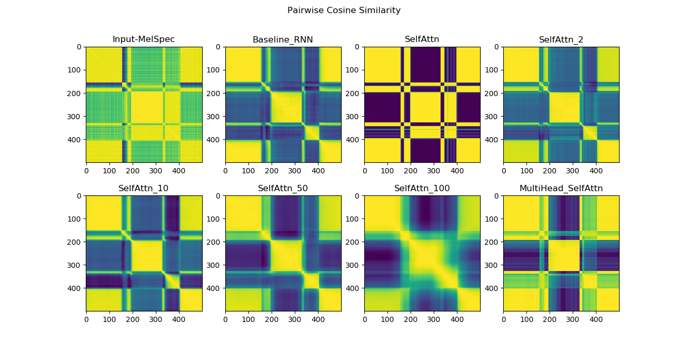
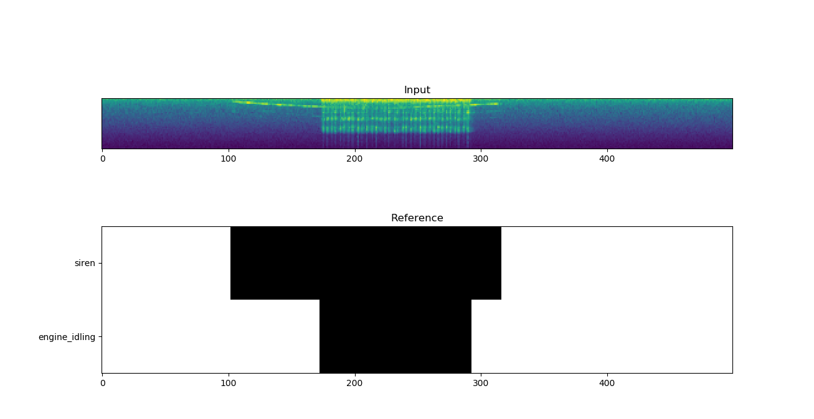
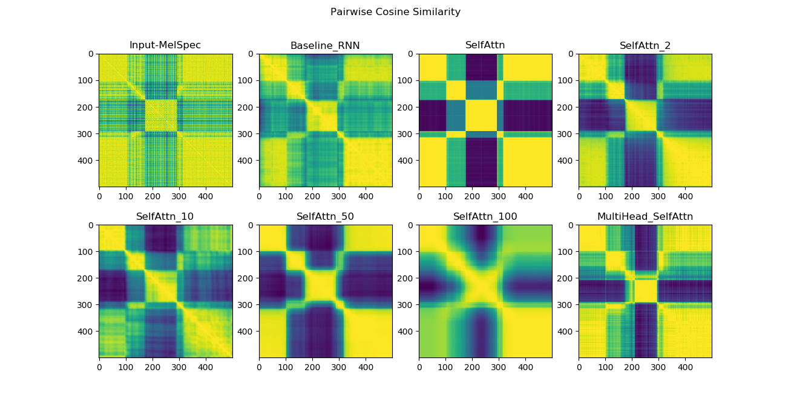
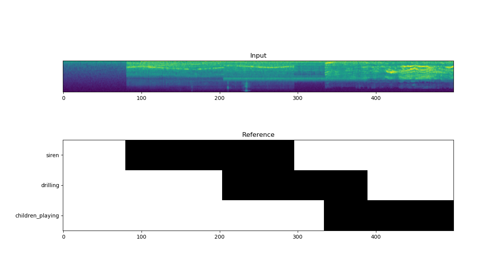
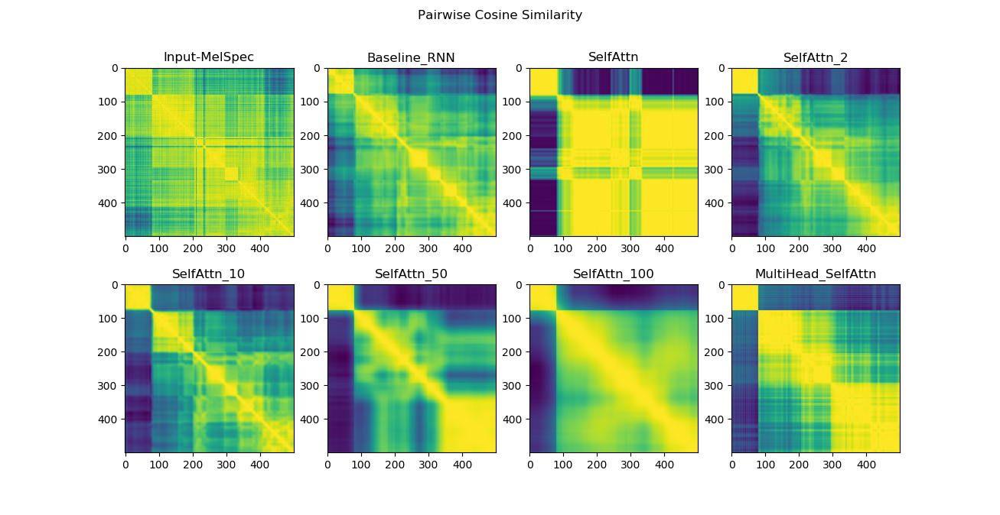

### Memory Controlled Self Attn
Memory controlled sequential self attention for sound recognition

### Self Attention Visualizations

Each of the Figure below visualizes self attention plots obtained using frame-level pairwise cosine similarity of the Memory Controlled Self Attention feature embeddings of different models.

    Input-MelSpec: pairwise cosine similarity of input mel-spectrogram feature
    Baseline_RNN: pairwise cosine similarity of the GRU feature embeddings of the baseline model
    SelfAttn: pairwise cosine similarity of the self attention feature embeddings of the model without memory control
    SelfAttn_L: pairwise cosine similarity of the memory controlled self attention feature embeddings of the model with attention width L
    MultiHead_SelfAttn: pairwise cosine similarity of the memory controlled self attention feature embeddings of the MultiHead model

>Figure 1

>Figure 2

>Figure 3

>Figure 4

### Acknowledgement

Memory controlled multi head self attention is developed using  [Keras Self-Attention](https://pypi.org/project/keras-self-attention/).
